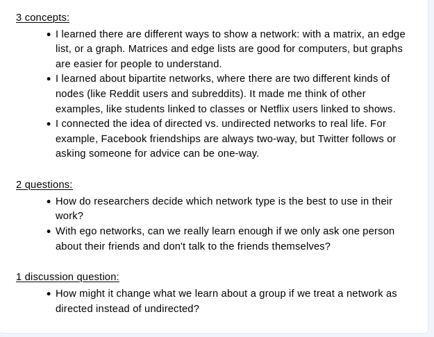

## Today's Dad Joke

What do you call a chess club bragging about their recent win in a hotel lobby?

<span class='fragment'>Chess nuts boasting in an open foyer.</span>


## Housekeeping

> - Intro survey
> - Discussion questions
> - Homework 1
>	- All were due Monday at noon

## 3-2-1 Example




## The Plan

> - Housekeeping / Announcements (5-10)
> - Discussion and review (35-45)
> - Consolidation and Confusion (10-15)
>	- Response to needs
>	- Discuss at end of class


## Review

> - Conceptual review every Tuesday
>	- Encouragement to be prepared
>	- Time to identify confusion - it's OK to be confused!
> - Homework Review
> - Discussion questions review

# Homework and Reading Review

## Class Questions

> - What do you want to talk about today?

## Basic Concepts

> - What is a node?
> - What is an edge?
> - What is the "individual" perspective of data and how does it differ from a network perspective?

## Network Representations

```{r, message=F,warning=F,echo=F}
library(igraph)
set.seed(24)
G = erdos.renyi.game(5, .4)
plot(G)
```

> - What is the edgelist of this graph?
> - What is the matrix representation of this graph?

## Questions from homework?

## Questions from 3-2-1s

> - Bipartite networks and projections
>   - Is group affiliation really a relationship?
> - How can you find patterns in large networks?
> - Multiplex networks
> - How do you set network boundaries?
> - How can we visualize how networks change over time?

## Discussion Questions


## Consolidation

> - What were some of the key ideas?
> - What are you thinking differently about now?
> - What are remaining questions/confusions?

## Thursday

> - Take ~ an hour to try to install everything, work on R Lab 1
> - Mostly working on R Lab together
