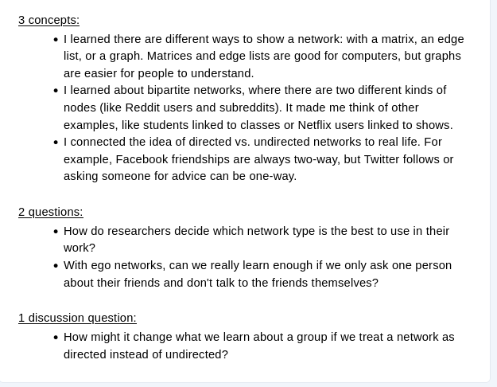

## Today's Dad Joke

I wanted to marry a Carbon 14 expert but all she wanted to do was date.


## Housekeeping

> - Intro survey
> - Discussion questions
> - Homework 1
>	- All were due Monday at 1 pm

## 3-2-1 Example




## The Plan

> - Housekeeping / Announcements (5-10)
> - Discussion and review (40-50)
> - Consolidation and Confusion (5-10)
>	- Response to needs


## Review

> - Conceptual review every Tuesday
>	- Encouragement to be prepared
>	- Time to identify confusion - it's OK to be confused!
> - Homework Review
> - Discussion questions review

# Homework and Reading Review

## Class Questions

> - What do you want to talk about today?

## Basic Concepts

> - What is a node?
> - What is an edge?
> - What is the "individual" perspective of data and how does it differ from a network perspective?

## Network Representations

```{r, message=F,warning=F,echo=F}
library(igraph)
set.seed(24)
G = erdos.renyi.game(5, .4)
plot(G)
```

> - What is the edgelist of this graph?
> - What is the matrix representation of this graph?

## Questions from homework?

> - What is a family member?

## Questions from 3-2-1s

> - When to use different representations (edgelist vs. matrix, etc.)
> - Bipartite networks and projections
> - Can visualizations change your understanding of a network?
> - How do you determine what counts as a tie?
> - How can we represent weaker or stronger ties?


## Questions from 3-2-1s

## Discussion Questions

> - How can the misperceptions that can come from taking an individual perspective be intentionally used to sway the general public's opinions on certain issues?
> - How can you tell whether shared attributes cause a tie or whether a tie causes shared attributes?

## Consolidation

> - What were some of the key ideas?
> - What are you thinking differently about now?
> - What are remaining questions/confusions?

## Thursday

> - Take ~ an hour to try to install everything, work on R Lab 1
> - Mostly working on R Lab together
