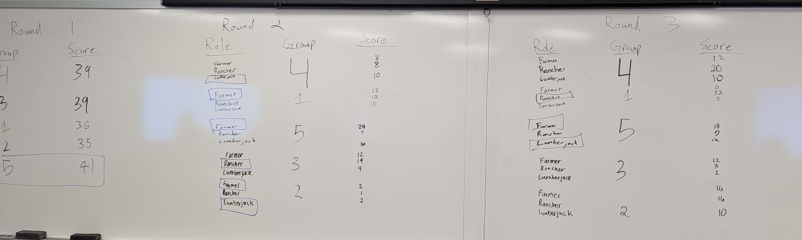

```{r setup, include=FALSE}
knitr::opts_chunk$set(echo = FALSE)
knitr::opts_knit$set(root.dir = './')
#source("resources/preamble.R")
set.seed(0121)
library(igraph)
library(tidygraph)
library(ggraph)
library(tidyverse)
```

## Dad Joke

I married my wife for her looks

<span class='fragment'>
But not the ones she's been giving me lately!
</span>

## Housekeeping

> - Thursday - Troubled Lands Activity
> - Final Project Ideas due (yesterday)
> - Self Assessment, Lab 6, and Social Search all due after Spring Break

<!--
## Troubled Lands Reflection



## Troubled Lands Reflection

> - What did you think about while playing?
> - How did you feel as you played? Did those feeling change across different versions of the game?
> - When do you help others in real life?

## Troubled Lands Reflection

> - Were resources and abilities distributed fairly?
> - How should resources be distributed in the real world?
> - What role did communication play? How did your group make decisions?
> - Did you work to make things equal? Why or why not?
> - What kinds of inequality appeared in the game?

## Troubled Lands Reflection

> - Did anyone sanction someone else? Why?
-->

## Review Questions

> - What is a degree distribution?
> - What is a scale-free distribution?

<div style="position:relative; width:640px; height:480px; margin:0 auto;">
<div class='fragment' style="position:absolute;top:0;left:0;">
```{r}
set_graph_style()

G = play_barabasi_albert(10000, growth = 1, power = 1)

df = G |> 
  as_tbl_graph() |>
  activate(nodes) |>
  mutate(degree = centrality_degree(mode='all')) |>
  as_tibble() |>
  group_by(degree) |>
  tally(name = 'count')


df |> 
  filter(degree > 1) |>
  ggplot(aes(x = degree, y = count)) + 
  geom_line() + 
  theme_minimal() +
  labs(title="All nodes")

```

</div>

<div class='fragment' style="position:absolute;top:0;left:0;">
```{r}
df |> 
  filter(degree > 2) |>
  ggplot(aes(x = degree, y = count)) + 
  geom_line() + 
  theme_minimal() + 
  labs(title="Nodes with degree of at least 3")
```
</div>

<div class='fragment' style="position:absolute;top:0;left:0;">
```{r}
df |> 
  filter(degree > 3) |>
  ggplot(aes(x = degree, y = count)) + 
  geom_line() + 
  theme_minimal() + 
  labs(title="Nodes with degree of at least 4")
```

</div>
</div>


## Review Questions

> -	When/where do we find scale-free distributions?
> - What is an example of a network that would *not* have a scale-free distribution?
> - What are the benefits and drawbacks of scale-free networks?

## Review Questions

> - What is the "friendship paradox"?
> - How is the friendship paradox useful?

## Friendship Paradox Example

<div class='fragment'>
```{r, out.width="45%"}

set_graph_style()

G = barabasi.game(10, m = 2)

G = G |> as_tbl_graph() |>
  mutate(degree = centrality_degree(mode='all'),
         neighbor_degree = local_ave_degree())
p = G |> 
  ggraph(layout = 'kk') +
  geom_edge_fan() +
  geom_node_point(color='lightblue', size = 16) +
  geom_node_text(aes(label=degree), size = 12, fontface='bold')
 
p
```

</div>
<div class='fragment'>

```{r, out.width="45%"}

p + 
  geom_node_point(aes(color = neighbor_degree > degree), size = 16) +
  geom_node_text(aes(label=round(neighbor_degree, 2)), nudge_y = -.1, size=9) +
  geom_node_text(aes(label=degree), nudge_y = .1, size=9) +
  scale_color_viridis_d("Neighbors have higher degree", begin = .6, end = .85, )

```

</div>

## Discussion Questions

> - Where else do rich-get-richer dynamics appear in society?

## Discussion Questions

> - If networks naturally tend to follow the idea of preferential attachment, how can newer nodes, like a startup company or a new student, overcome this disadvantage and become a hub? 
> - One of the implications for scale-free networks is that outcomes are unfair and random, but in real life, people may have attributes that allow them to get ahead. I'm confused how both of these are true.
> - Does the friendship paradox only apply to popularity (degree), or could it apply to other attributes (e.g., wealth, happiness, etc.)?

## Discussion Questions

> - How reliable is using friends of randomly selected individuals as a way to identify the most central or influential people in a network? 
> - In the group-size effect, why are people more likely to experience larger groups instead of average-sized ones?

## Discussion Questions

> - If we can mathematically prove that through comparison with our connections most of us will be left feeling relatively inadequate, then why compare?
> - Why do skewed networks react differently to random failures?
> - Could other things outweigh rich-get-richer in real-world networks? What are some examples?

## Discussion Questions

> - Do the benefits of using social networks data to detect disease outbreaks earlier outweigh the potential privacy concerns of monitoring people's connections and online activity? 


## Visualization Challenge

